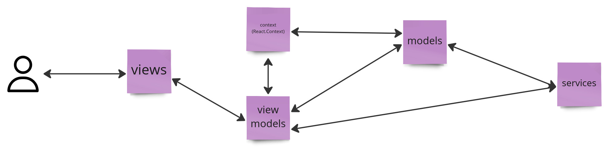

# Getting Started with Roll My Dices
This simple app enables User to roll a selected dice. User can change also interface language and color theme. \
The last stable version of the app is available here: https://ndv66.github.io/roll-my-dices/

#### Why?
Because I want to have a simple example with RxJS where I'm able to learn new topics :)

## How to: run locally
- Node.js (>= 16) is installed
- yarn or npm is installed
- run `yarn install`
- run `yarn start`

## How to: deploy
0. Change version in the `package.json`.
1. Merge all changes to the master.
2. Refresh master locally. \
`git pull origin master`
3. Create git tag. \
`git tag -a vX.X.X -m "What was done"` \
`git push --tags`
4. Run `yarn deploy`.
5. Wait... wait...
6. Go to the `https://ndv66.github.io/roll-my-dices/`
7. See your changes :)

# Folder structure

#### `/context`
React Context and its wrapper.

#### `/langs`
Files with translations.

#### `/models`
All app MAIN models for store and manipulate any data. \
Each of them should be use as singletons (always).

#### `/models/rolls`
All app models for rolling dice and manipulate these result.

#### `/services`
All hard app logic (calculations etc.)

#### `/styles`
All app themes (light, dark) variables and basic plain CSS (like @font-face).

#### `/tools`
All helpers, tools etc.

#### `/types`
All more important types in the application.

#### `/view`
All views of the applications. It contains `elements` and `page` folders, where:

- `/view/elements`
All basic elements with ots styles, like buttons, inputs etc.

- `/view/page`
All main elements of the main page.

### `/viewModels`
Dedicated model () for every view (if needed).

# Code pattern
- `View` is a bigger visual component, a part of the page (for example: rolls element).
 - `ViewModel` is a dedicated data source for the view.
- `Context (from React)` is a place for all global settings (for example: default language). Any changes in these variables makes changes in the full app, see https://reactjs.org/docs/context.html for more details.
- `Model` is a place for storing data. Every model should be a logic part of the feature.
- `Service` is a place for making all app business logic (for example: calculations).

Connections between described above elements are showed here:

# Available Scripts
In the project directory, you can run:

- `yarn start`
Runs the app in the development mode.\
Open [http://localhost:3000](http://localhost:3000) to view it in the browser.

- `yarn test` (NOT YET)
Launches the test runner in the interactive watch mode.\
See the section about [running tests](https://facebook.github.io/create-react-app/docs/running-tests) for more information.

- `yarn build`
Builds the app for production to the `build` folder.\
It correctly bundles React in production mode and optimizes the build for the best performance. The build is minified and the filenames include the hashes.\
The app is ready to be deployed!

- `yarn deploy`
Deploy the app for production using gh-pages module.

//https://dev.to/this-is-learning/rxjs-marble-testing-2gg9
//https:jdkandersson.com/2019/06/10/testing-rxjs-service-with-a-subject-component-interaction/
// https://generic-ui.com/blog/rxjs-testing-patterns

#FEATURES
- roll "wild" (custom) dice
- roll "explosion" dice
- highlight in the fate ladder what this roll means
- screen tests
- unit tests for components
